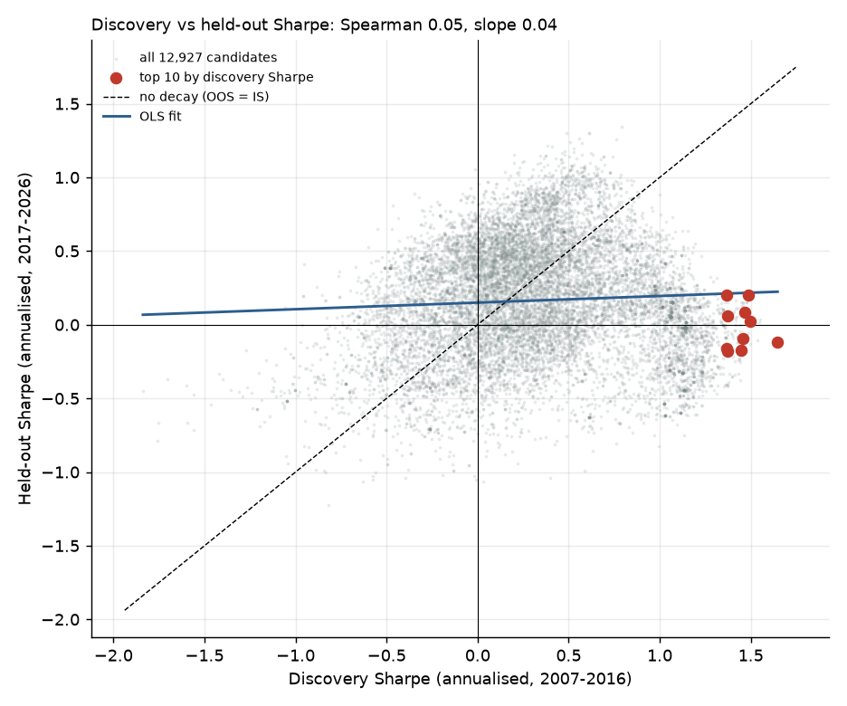
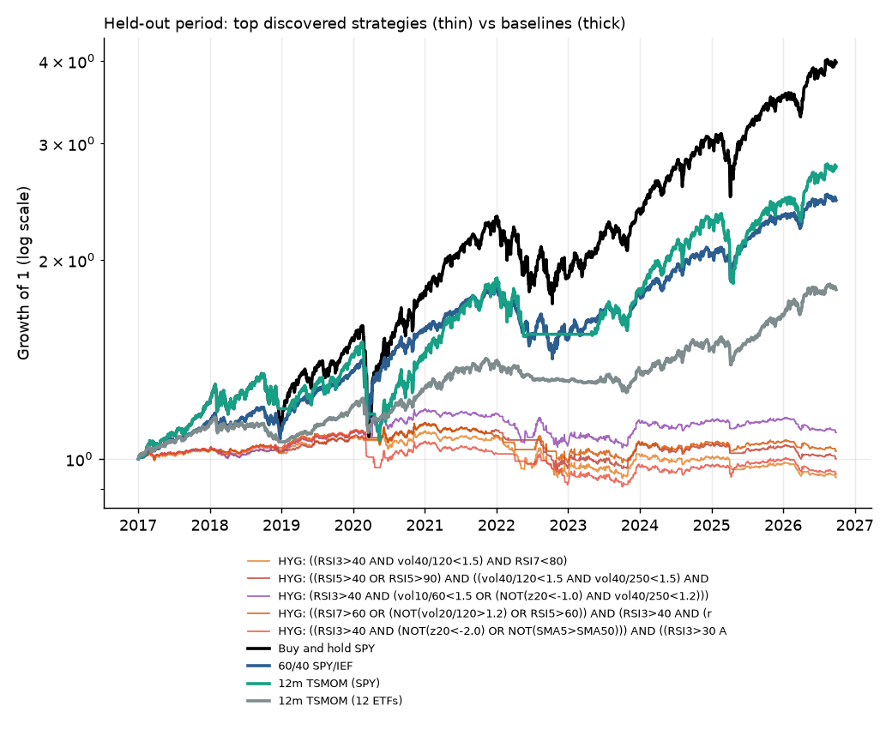
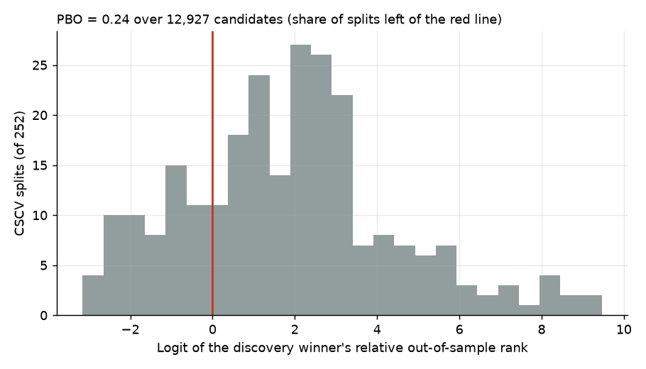

# alpha-graveyard: automated strategy discovery, and why most discoveries are fake

[](https://github.com/CH4RL3I/alpha-graveyard/actions/workflows/ci.yml)  

Where discovered strategies go to die. Python package: `stratgen`.

A search engine that finds trading strategies is easy to build. The valuable part is showing,
honestly, which of its discoveries survive a held-out period and the corrections for having tried
thousands of things. This repo does both on twelve liquid ETFs and reports what it finds.

**Headline (seed 0, 15,000 unique candidates): nothing survived.** The best candidate scored a
discovery Sharpe of 1.65. Its held-out Sharpe was -0.12. None of the top 10 passed the Deflated
Sharpe test on discovery data, and none beat buy-and-hold SPY out of sample.



Each grey dot is one candidate strategy. The x axis is what the search saw, the y axis is the
2017-2026 period it never touched. If discovery Sharpe carried information, the cloud would
follow the dashed diagonal. It follows the flat blue line instead (Spearman 0.05).

## Results

Search: seed 0, 15,000 unique candidates evaluated (12,927 tradeable, meaning at least 20 position
changes in discovery). Discovery 2007-04-11 to 2016-12-30 (2,451 days), held-out 2017-01-03 to
2026-09-28 (2,447 days). One-way cost 5 bps. Sharpe ratios are annualised, net of cost.

Top 10 by discovery Sharpe, after dropping any strategy with discovery-return correlation above
0.9 to a better one. "DSR (IS)" is the Deflated Sharpe Ratio of the discovery returns for N =
15,000 trials; values below 0.95 are not significant. "OOS PSR" is the Probabilistic Sharpe Ratio
of the held-out returns against zero.

| Strategy | IS SR | OOS SR | Asset B&H OOS SR | DSR (IS) | OOS PSR | Survives |
|---|---|---|---|---|---|---|
| HYG: ((RSI3>40 AND vol40/120<1.5) AND RSI7<80) | 1.65 | -0.12 | 0.54 | 0.16 | 0.36 | no |
| HYG: ((RSI5>40 OR RSI5>90) AND ((vol40/120<1.5 AND vol40/250<1.5) AND RSI3>40)) | 1.49 | 0.02 | 0.54 | 0.07 | 0.53 | no |
| HYG: (RSI3>40 AND (vol10/60<1.5 OR (NOT(z20<-1.0) AND vol40/250<1.2))) | 1.49 | 0.20 | 0.54 | 0.07 | 0.74 | no |
| HYG: ((RSI7>60 OR (NOT(vol20/120>1.2) OR RSI5>60)) AND (RSI3>40 AND (ret42>-2% OR SMA30>SMA100))) | 1.47 | 0.09 | 0.54 | 0.06 | 0.61 | no |
| HYG: ((RSI3>40 AND (NOT(z20<-2.0) OR NOT(SMA5>SMA50))) AND ((RSI3>30 AND SMA50>SMA100) OR z20>1.0)) | 1.46 | -0.09 | 0.54 | 0.05 | 0.39 | no |
| HYG: (RSI2>40 AND (RSI2>30 AND vol40/60<1.2)) | 1.45 | -0.18 | 0.54 | 0.05 | 0.29 | no |
| HYG: (RSI21<30 OR (RSI2>40 AND ret10>-2%)) | 1.37 | -0.18 | 0.54 | 0.02 | 0.29 | no |
| HYG: ((RSI2>40 OR (NOT(RSI5>60) OR vol40/60<0.6)) AND (RSI2>30 AND vol40/120<1.2)) | 1.37 | 0.06 | 0.54 | 0.03 | 0.57 | no |
| HYG: (RSI2>40 AND ((vol20/250<1.5 AND SMA50>SMA150) OR z20>1.0)) | 1.37 | -0.16 | 0.54 | 0.03 | 0.31 | no |
| HYG: (RSI2>30 AND NOT(vol40/250>1.2)) | 1.37 | 0.20 | 0.54 | 0.03 | 0.73 | no |

A strategy "survives" only if all three hold: DSR (IS) at least 0.95, OOS PSR at least 0.95, and
OOS Sharpe above buy-and-hold SPY. Zero of ten do. The full table with CAGR and drawdown is in
`results/top_strategies.csv`.

Across all candidates:

| Statistic | Value |
|---|---|
| Spearman rank correlation, IS vs OOS Sharpe | 0.05 |
| Median IS Sharpe / median OOS Sharpe | 0.28 / 0.16 |
| Share with IS Sharpe above 1 | 12.2% |
| Of those, share with positive OOS Sharpe | 40.1% |
| Top decile by IS: mean IS Sharpe / mean OOS Sharpe | 1.17 / -0.08 |
| Mean OOS percentile of the top 10 | 33rd |
| Candidates whose OOS Sharpe beats buy-and-hold SPY (0.91) | 290 of 12,927 (2.2%) |
| Expected best Sharpe of 15,000 skill-free trials (DSR benchmark, SR0) | 1.94 |
| Best discovery Sharpe actually found | 1.65 |
| PBO (CSCV, 10 blocks, 252 splits, discovery period) | 0.24 |

The best discovery Sharpe (1.65) is below what pure luck is expected to produce from this many
trials (1.94). The search found nothing that noise would not have found.

### Baselines, same timing and cost model

| Baseline | IS SR | OOS SR | OOS CAGR | OOS vol | OOS max DD |
|---|---|---|---|---|---|
| Buy and hold SPY | 0.42 | 0.91 | 15.3% | 17.4% | -32.0% |
| 60/40 SPY/IEF | 0.65 | 0.94 | 9.7% | 10.5% | -22.3% |
| 12m TSMOM (SPY) | 0.62 | 0.80 | 11.0% | 14.4% | -29.1% |
| 12m TSMOM (12 ETFs) | 0.53 | 0.92 | 6.3% | 6.8% | -11.3% |

The simple rules, none of which were searched over, held up better than every discovered
strategy: three of the four baselines have an OOS Sharpe above 0.9, and the best discovered
top-10 strategy reaches 0.20.



### Reading the PBO with care

PBO is 0.24, which on its own looks reassuring (0.5 is coin-flip selection). It measures something
narrower than the held-out test: CSCV recombines contiguous blocks of the discovery period, so
the 2008-2009 credit crash falls into both halves of many splits. All ten top strategies trade
HYG (high-yield credit), and I read this as crash-avoidance rules that keep ranking well
whenever the crash is on either side of a split. That reading is a hypothesis; I did not test it
separately. What is measured is that the same winners fell to the 33rd OOS percentile when the
data really was new. PBO is a within-sample diagnostic; a real held-out period is the stronger test.



### Other seeds

Reported for transparency, not selected. Same protocol, 15,000 trials each.

| Seed | Best IS SR | Spearman IS/OOS | Top-decile mean OOS SR | PBO | Survivors (of top 10) |
|---|---|---|---|---|---|
| 0 (headline) | 1.65 | 0.05 | -0.08 | 0.24 | 0 |
| 1 | 1.59 | 0.18 | 0.11 | 0.22 | 0 |
| 2 | 1.49 | 0.13 | 0.01 | 0.24 | 0 |

Per-seed summaries are in `results/seed1/` and `results/seed2/`. The top 10 is all HYG in every seed.

## Method

**Data.** Daily adjusted open and close for SPY, QQQ, IWM, EFA, EEM, TLT, IEF, GLD, DBC, VNQ, HYG
and LQD from Yahoo Finance's public chart endpoint (no key needed; Stooq now serves a JavaScript
challenge and cannot be scraped with plain CSV downloads). Open is rescaled by adjclose/close so
both are total-return adjusted. The common history starts 2007-04-11 (HYG's launch). Prices are
not redistributed here: `stratgen fetch` downloads them into `data/` (gitignored). The figures and
`results/` in this repo come from the panel fetched on 2026-09-28.

**Search space.** A rule is a boolean expression over one asset, long when true, flat otherwise.
Leaves: SMA crossover, lookback return above a threshold, Wilder RSI above/below a level,
z-score against an SMA, short/long realised-volatility ratio. Leaves can be negated and combined
with AND / OR to depth 3. Search is 60% random sampling, then a genetic algorithm (tournament
selection, subtree crossover, parameter/leaf/subtree mutation, population 300) that maximises
discovery Sharpe. The asset is part of the genome.

**Execution, no lookahead.** A signal at day t uses closes up to t. The order fills at the open of
t+1, and the position earns open-to-open returns from there. Cost is 5 bps one-way per unit of
turnover (assumed 2 bps commission and half-spread plus 3 bps slippage), charged on every
position change. Flat earns zero. Tests confirm that returns on truncated data equal the prefix of
returns on the full data, and that a signal cannot capture the move that triggered it.

**Protocol.** Discovery is every date before 2017-01-01. The search receives only that slice, and a
test scrambles everything after the split to confirm the search output does not change. The
held-out period is scored once, after the candidate list is frozen. `trials` counts unique
candidates evaluated; duplicates hit a cache and are not counted.

**Overfitting statistics** come from the author's own library,
[fluke](https://github.com/CH4RL3I/fluke) (`overfit` package): CSCV/PBO,
the Probabilistic and Deflated Sharpe Ratio. The DSR uses N = 15,000 trials and the
cross-sectional variance of the tradeable candidates' Sharpe ratios.

## Reproduce

```bash
uv sync
uv run stratgen fetch                       # downloads prices into data/
uv run stratgen search --trials 15000 --seed 0
uv run stratgen report                      # results/, docs/figures/
uv run pytest -q && uv run ruff check .
```

The search takes a few seconds, the report about 20 seconds. Results depend on the data vintage:
the numbers above use prices through 2026-09-28; a later fetch extends the held-out period.

## Limitations

- **Survivorship in the ETF selection.** The twelve ETFs are today's large, surviving funds,
  picked with hindsight. Their existence in 2007 is not proof they were the obvious choice then.
- **Costs.** A flat 5 bps one-way is a reasonable guess for liquid ETFs, not a measured figure.
  There is no market impact, borrow, tax or bid-ask spread that varies with volatility. Cash
  earns nothing, which understates the flat-period return of every long/flat rule in the
  higher-rate years of the held-out period.
- **Single split.** One discovery/validation cut, not walk-forward. Different cut dates would
  give different numbers, and nine years of held-out data is one draw of the market.
- **Regime dependence.** Discovery contains the 2008 crash and its aftermath, the held-out
  period contains 2020 and the 2022 rate shock. Every top strategy picked HYG, which suggests
  discovery rewarded avoiding one regime.
- **DSR assumes independent trials.** Rule variants are highly correlated, so the effective
  number of trials is lower than 15,000 and the DSR here is conservative. The conclusion does not
  rest on the DSR alone: the held-out result agrees with it.
- **Trials outside this run.** A first 30,000-trial seed-0 search was run and abandoned because
  the report's memory use exceeded what this shared machine could give (I saw only its best
  discovery Sharpe, 1.68). The design was then reduced to 15,000 trials and 10 CSCV blocks. That
  was a resource decision made before any held-out number had been computed. Seeds 1 and 2 were
  run afterwards and are reported above.
- **Search depth.** Fitness is raw Sharpe with only a 20-change minimum. A different fitness
  (for example one penalising complexity) could do better; this run does not test that.

## License

MIT, Emilio Gappa, 2026.
